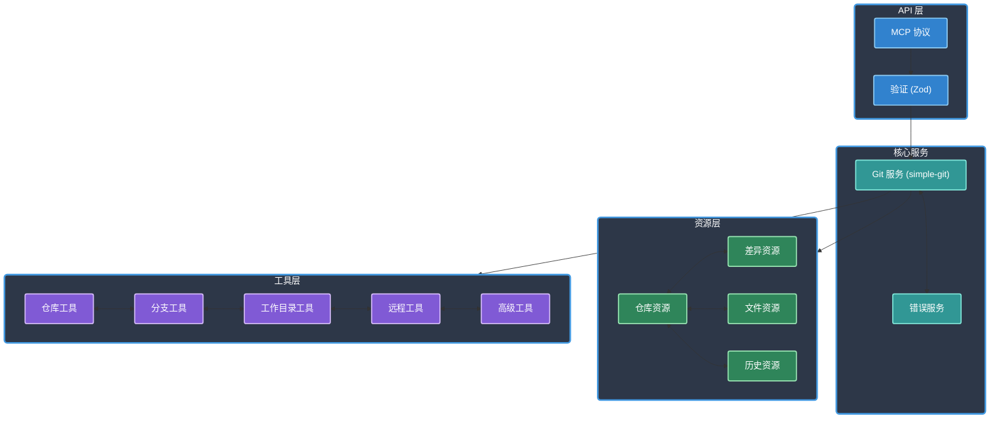

# GIT MCP 服务器

> 中文适配和自己使用习惯

[](https://www.typescriptlang.org/)
[](https://modelcontextprotocol.io/)
[]()
[](https://opensource.org/licenses/Apache-2.0)
[]()
[](https://github.com/cyanheads/git-mcp-server)

一个提供 Git 仓库交互工具的模型上下文协议（MCP）服务器。该服务器允许 AI 助手和 LLM 代理通过标准化接口管理仓库、分支、提交和文件，无需直接访问文件系统或命令行。它使用 `simple-git` 库作为核心功能，同时保持适当的安全边界，将 Git 操作作为 MCP 资源和工具暴露。

## 目录

- [概述](#概述)
  - [架构与组件](#架构与组件)
- [功能特性](#功能特性)
  - [资源访问](#资源访问)
  - [Git 操作](#git-操作)
- [安装](#安装)
  - [前置条件](#前置条件)
  - [从 NPM 安装](#从-npm-安装)
  - [从源码安装](#从源码安装)
- [使用方法](#使用方法)
  - [运行服务器](#运行服务器)
  - [与 Claude 集成](#与-claude-集成)
  - [与其他 MCP 客户端集成](#与其他-mcp-客户端集成)
- [项目结构](#项目结构)
- [工具](#工具)
  - [仓库操作](#仓库操作)
  - [分支操作](#分支操作)
  - [工作目录操作](#工作目录操作)
  - [远程操作](#远程操作)
  - [高级操作](#高级操作)
- [资源](#资源)
  - [仓库资源](#仓库资源)
- [开发](#开发)
  - [构建和测试](#构建和测试)
- [许可证](#许可证)

## 概述

主要功能：

- **仓库管理**：初始化、克隆和检查仓库状态
- **分支操作**：创建、列出、检出、删除和合并分支
- **工作目录**：暂存文件、提交更改、创建差异
- **远程操作**：添加远程仓库、获取、拉取、推送
- **高级 Git 命令**：管理标签、暂存更改、拣选、变基

### 架构与组件

核心系统架构：

<details>
<summary>点击展开 Mermaid 图表</summary>



</details>

核心组件：

- **MCP 服务器（`server.ts`）**：使用 `@modelcontextprotocol/sdk` 创建服务器，暴露资源和工具。
- **Git 服务（`services/git-service.ts`）**：`simple-git` 库的抽象层，提供清晰的 Git 操作接口。
- **资源（`resources/`）**：通过 MCP 资源暴露 Git 数据（如状态、日志、文件内容），使用一致的 URI 模板。
- **工具（`tools/`）**：通过 MCP 工具暴露 Git 操作（如提交、推送、拉取），使用明确定义的输入模式（使用 Zod 验证）。
- **错误处理（`services/error-service.ts`）**：Git 和 MCP 操作的标准化错误处理和报告。
- **入口点（`index.ts`）**：初始化和启动服务器，连接到标准 I/O 传输。

## 功能特性

### 资源访问

通过 MCP 资源暴露 Git 仓库信息：

- **仓库信息**：访问基本 Git 仓库信息，包括当前分支、状态和引用详情
- **仓库分支**：列出所有分支，并标识当前分支
- **仓库远程**：列出所有配置的远程仓库及其 URL
- **仓库标签**：列出所有标签及其引用
- **文件内容**：访问特定文件在给定 Git 引用下的内容
- **目录列表**：查看特定路径和引用下的文件和目录列表
- **差异**：获取引用之间、未暂存更改或已暂存更改的差异
- **提交历史**：查看详细的提交日志，包括作者、日期和消息信息
- **文件追溯**：查看每行代码的最后修改提交
- **提交详情**：访问特定提交的详细信息，包括差异更改

### Git 操作

通过 MCP 工具执行 Git 命令：

- **仓库操作**：初始化仓库、从远程克隆、检查仓库状态
- **分支操作**：创建分支、列出分支、检出、删除分支、合并
- **工作目录操作**：暂存文件、取消暂存、提交更改、创建差异
- **远程操作**：添加远程仓库、列出远程仓库、获取、拉取、推送
- **高级操作**：管理标签、暂存更改、拣选提交、变基分支、重置、清理

## 安装

### 前置条件

- Node.js 16 或更高版本
- Git 已安装并可在 PATH 中访问

### 从 NPM 安装

```bash
npm install -g @cyanheads/git-mcp-server
```

### 从源码安装

```bash
git clone https://github.com/cyanheads/git-mcp-server.git
cd git-mcp-server
npm install
npm run build
```

## 使用方法

### 运行服务器

如果通过 NPM 全局安装：

```bash
git-mcp-server
```

如果从源码运行：

```bash
node build/index.js
```

服务器通过 stdin/stdout 使用模型上下文协议进行通信，使其与任何 MCP 客户端兼容。

### 与 Claude 集成

添加到您的 Claude 配置文件（例如，`cline_mcp_settings.json` 或 `claude_desktop_config.json`）：

```json
{
  "mcpServers": {
    "git": {
      "command": "git-mcp-server", // 或未全局安装时的 build/index.js 完整路径
      "args": [],
      "env": {},
      "disabled": false,
      "autoApprove": [] // 根据需要配置自动批准规则
    }
  }
}
```

### 与其他 MCP 客户端集成

使用 MCP 检查器测试服务器：

```bash
# 如果全局安装
npx @modelcontextprotocol/inspector git-mcp-server

# 如果从源码运行
npx @modelcontextprotocol/inspector build/index.js
```

## 项目结构

代码库采用模块化结构：

```
git-mcp-server/
├── src/
│   ├── index.ts           # 入口点：初始化和启动服务器
│   ├── server.ts          # 核心 MCP 服务器实现和设置
│   ├── resources/         # MCP 资源实现
│   │   ├── descriptors.ts # 资源 URI 模板和描述
│   │   ├── diff.ts        # 差异相关资源（已暂存、未暂存、提交）
│   │   ├── file.ts        # 文件内容和目录列表资源
│   │   ├── history.ts     # 提交历史和追溯资源
│   │   ├── index.ts       # 聚合和注册所有资源
│   │   └── repository.ts  # 仓库信息、分支、远程、标签资源
│   ├── services/          # 核心逻辑和外部集成
│   │   ├── error-service.ts # 集中式错误处理工具
│   │   └── git-service.ts   # simple-git 操作的抽象层
│   ├── tools/             # MCP 工具实现
│   │   ├── advanced.ts    # 高级 Git 工具（标签、暂存、拣选、变基、日志、显示）
│   │   ├── branch.ts      # 分支管理工具（列表、创建、检出、删除、合并）
│   │   ├── index.ts       # 聚合和注册所有工具
│   │   ├── remote.ts      # 远程交互工具（添加、列表、获取、拉取、推送）
│   │   ├── repository.ts  # 仓库级别工具（初始化、克隆、状态）
│   │   └── workdir.ts     # 工作目录工具（添加、重置、提交、差异、重置提交、清理）
│   ├── types/             # TypeScript 类型定义
│   │   └── git.ts         # Git 操作相关的自定义类型
│   └── utils/             # 共享工具函数
│       ├── global-settings.ts # 管理全局工作目录设置
│       └── validation.ts  # 输入验证模式（Zod）和辅助函数
├── build/                 # 编译后的 JavaScript 输出
├── docs/                  # 文档文件
├── logs/                  # 日志文件（如果有）
├── scripts/               # 开发辅助脚本（如清理、树形结构）
├── .env.example           # 环境变量示例
├── .gitignore             # Git 忽略规则
├── LICENSE                # 项目许可证文件
├── package.json           # 项目元数据和依赖
├── package-lock.json      # 依赖锁定文件
├── README.md              # 本文档
└── tsconfig.json          # TypeScript 编译器配置
```

## 工具

Git MCP 服务器提供了一套全面的 Git 操作工具：

### 仓库操作

| 工具         | 描述                                                     |
| ------------ | -------------------------------------------------------- |
| `git_init`   | 在指定路径初始化新的 Git 仓库，支持裸仓库选项。          |
| `git_clone`  | 从远程 URL 克隆 Git 仓库到本地路径，支持分支和深度选项。 |
| `git_status` | 获取 Git 仓库的当前状态，包括工作目录和暂存区的更改。    |

### 分支操作

| 工具                | 描述                                                 |
| ------------------- | ---------------------------------------------------- |
| `git_branch_list`   | 列出仓库中的所有分支，支持包含远程分支的选项。       |
| `git_branch_create` | 创建新分支，支持指定起始点和自动检出的选项。         |
| `git_checkout`      | 检出分支、标签或提交，支持在检出时创建新分支的选项。 |
| `git_branch_delete` | 删除分支，支持强制删除未合并分支的选项。             |
| `git_merge`         | 将分支合并到当前分支，支持自定义提交消息和合并策略。 |

### 工作目录操作

| 工具                | 描述                                                       |
| ------------------- | ---------------------------------------------------------- |
| `git_add`           | 暂存文件以提交，支持单个文件或整个目录。                   |
| `git_reset`         | 从暂存区取消暂存文件，支持特定文件或所有已暂存更改的选项。 |
| `git_commit`        | 提交已暂存的更改，支持自定义提交消息、作者信息和修改选项。 |
| `git_diff_unstaged` | 获取工作目录中所有未暂存更改的差异，支持特定文件的选项。   |
| `git_diff_staged`   | 获取索引中所有已暂存更改的差异，支持特定文件的选项。       |
| `git_reset_commit`  | 将仓库重置到特定引用，支持硬重置、软重置或混合模式选项。   |
| `git_clean`         | 从工作树中删除未跟踪的文件，支持目录和强制清理的选项。     |

### 远程操作

| 工具              | 描述                                                   |
| ----------------- | ------------------------------------------------------ |
| `git_remote_add`  | 添加新的远程仓库，包含名称和 URL。                     |
| `git_remote_list` | 列出所有配置的远程仓库及其 URL。                       |
| `git_fetch`       | 从远程仓库获取更新，支持特定分支的选项。               |
| `git_pull`        | 从远程仓库拉取更改，支持变基策略选项。                 |
| `git_push`        | 将本地更改推送到远程仓库，支持强制推送和上游跟踪选项。 |

### 高级操作

| 工具               | 描述                                               |
| ------------------ | -------------------------------------------------- |
| `git_tag_create`   | 创建新标签，支持带消息的注释标签选项。             |
| `git_tag_list`     | 列出仓库中的所有标签及其引用。                     |
| `git_stash_create` | 暂存工作目录中的更改，支持未跟踪文件和描述的选项。 |
| `git_stash_list`   | 列出仓库中的所有暂存及其描述。                     |
| `git_stash_apply`  | 应用暂存的更改，但不从暂存列表中移除。             |
| `git_stash_pop`    | 应用暂存的更改并从暂存列表中移除。                 |
| `git_cherry_pick`  | 将特定提交的更改应用到当前分支。                   |
| `git_rebase`       | 将当前分支变基到另一个分支，支持交互模式选项。     |
| `git_log`          | 获取提交历史，支持自定义输出格式和深度。           |
| `git_show`         | 显示特定提交的详细信息，包括差异更改。             |

## 资源

Git MCP 服务器通过标准 MCP 资源暴露 Git 数据：

### 仓库资源

| 资源                                                        | 描述                                            |
| ----------------------------------------------------------- | ----------------------------------------------- |
| `git://repo/{repoPath}/info`                                | 基本 Git 仓库信息，包括当前分支、状态和引用详情 |
| `git://repo/{repoPath}/branches`                            | 仓库中所有分支的列表，包含当前分支标识          |
| `git://repo/{repoPath}/remotes`                             | 所有配置的远程仓库及其 URL 的列表               |
| `git://repo/{repoPath}/tags`                                | 仓库中所有标签及其引用的列表                    |
| `git://repo/{repoPath}/file/{filePath}?ref={ref}`           | 返回特定文件在给定 Git 引用下的内容             |
| `git://repo/{repoPath}/ls/{dirPath}?ref={ref}`              | 返回特定路径和引用下的文件和目录列表            |
| `git://repo/{repoPath}/diff/{fromRef}/{toRef}?path={path}`  | 返回两个 Git 引用（提交、分支、标签）之间的差异 |
| `git://repo/{repoPath}/diff-unstaged?path={path}`           | 返回工作目录中所有未暂存更改的差异              |
| `git://repo/{repoPath}/diff-staged?path={path}`             | 返回索引中所有已暂存更改的差异                  |
| `git://repo/{repoPath}/log?maxCount={maxCount}&file={file}` | 返回提交历史日志，包含作者、日期和消息详情      |
| `git://repo/{repoPath}/blame/{filePath}`                    | 返回行级归属，显示每行最后修改的提交            |
| `git://repo/{repoPath}/commit/{commitHash}`                 | 返回特定提交的详细信息，包括差异更改            |

## 开发

### 构建和测试

```bash
# 构建项目
npm run build

# 监视更改并自动重新构建
npm run watch

# 使用 MCP 检查器工具在本地测试服务器
npm run inspector

# 清理构建产物
npm run clean

# 为文档生成文件树表示
npm run tree

# 完全清理和重新构建项目
npm run rebuild
```

## 许可证

Apache License 2.0 - 详见 [LICENSE](LICENSE)。

---

<div align="center">
使用模型上下文协议构建
</div>
